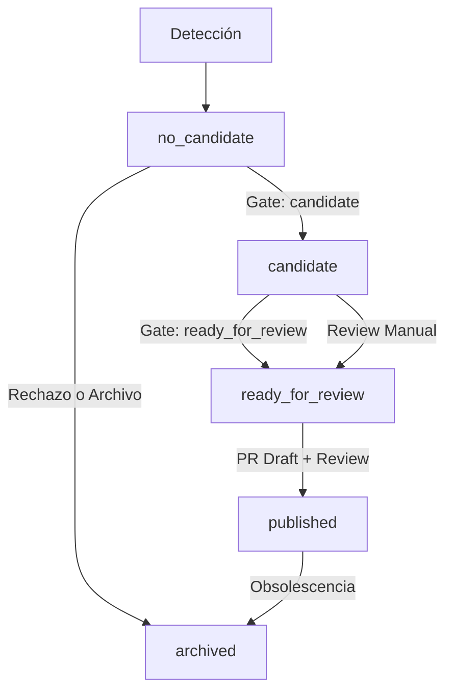

# Ciclo de Vida y Gobernanza de Señales

Este documento describe el modelo de gobernanza para la gestión de candidatos a señal en Quant Pulse, cubriendo desde la detección inicial hasta su publicación en el feed canónico o su archivo.

## Introducción

Para mantener la calidad y el rigor editorial exigidos por QuantLab, las señales no se añaden directamente al feed. Siguen un flujo de evaluación basado en **estados** y **puertas de aprobación (gates)** que aseguran que solo la información con masa crítica y confianza suficiente impacte en las decisiones downstream.

## Máquina de Estados

El ciclo de vida de un candidato se define por los siguientes estados:

### Definiciones de Estado

- **no_candidate**: Señal detectada que no cumple los umbrales mínimos de confianza o relevancia.
- **candidate**: Señal viable que requiere supervisión humana o mayor acumulación de pruebas.
- **ready_for_review**: Señal de alta confianza y puntuación que está lista para ser convertida en un PR hacia el feed principal.
- **published**: Señal activa en `content/pulse.source.json`.
- **archived**: Señal que ha cumplido su ciclo o ha sido descartada definitivamente.

## Puertas de Aprobación (Gates)

La lógica de transición está codificada en `automation/gates/approval_gates.yaml` y es enforced por el script `validate-candidates.mjs`.

### Umbrales del Slice 1

| Gate | Condición | Acción Resultante |
|------|-----------|-------------------|
| **no_candidate** | `score < 40` O `confidence < 0.50` | Archivo (sin PR) |
| **candidate** | `score >= 40` Y `confidence >= 0.50` | Notificación y cola de revisión |
| **ready_for_review** | `score >= 70` Y `confidence >= 0.75` Y `source ∈ tier_1` | Apertura automática de PR Draft |

## Separación de Responsabilidades

Quant Pulse mantiene una frontera clara entre:

1. **Capa Operativa (`automation/`)**: Donde viven los candidatos (`.json`), la política de gates (`.yaml`) y el registro de auditoría (`audit_trail.json`). Es una capa de "borrador" y evaluación.
2. **Capa Canónica (`content/pulse.source.json`)**: La fuente de verdad del feed validado. Solo se llega aquí mediante un PR aprobado que promociona un candidato a `published`.

## Auditoría y Trazabilidad

Cada candidato incluye un array `state_transitions` que registra:
- Estado origen y destino.
- Timestamp ISO 8601.
- Razón del cambio (por qué se aplicó el gate o qué decisión humana se tomó).

Esto permite reconstruir el proceso de decisión de cualquier señal que llegue a QuantLab.

## Ejemplo de Flujo (Evento CPI)

1. **Detección**: Se detecta un dato de inflación (CPI) de Bloomberg.
2. **Evaluación**: El motor de scoring asigna `score: 85` y `confidence: 0.90`.
3. **Gate**: El script identifica que cumple el gate `ready_for_review` (Score > 70, Conf > 0.75, Tier 1).
4. **Acción**: Se genera un PR Draft usando el template de candidatos.
5. **Review**: Un editor humano verifica la consistencia y aprueba el PR.
6. **Publicación**: El candidato se mueve a `published` y se integra en `pulse.source.json`.
